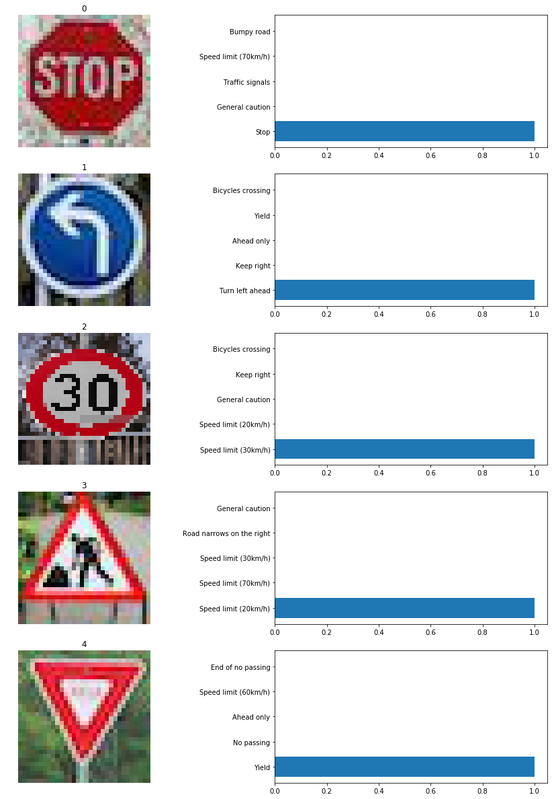

# Project: Build a Traffic Sign Recognition Program
[](http://www.udacity.com/drive)

## Overview
In this project, **deep neural networks** and **convolutional neural networks** are used to classify traffic signs. It includes training and validating a model so it can classify traffic sign images using the [German Traffic Sign Dataset](http://benchmark.ini.rub.de/?section=gtsrb&subsection=dataset). After the model is trained, the model is tried on images of German traffic signs that are collected on the web.

Udacity provided an Ipython notebook that contains further instructions
and starter code from [Ipython notebook](https://github.com/udacity/CarND-Traffic-Sign-Classifier-Project/blob/master/Traffic_Sign_Classifier.ipynb).

---
## The Project
The goals / steps of this project are the following:
* Load the data set
* Explore, summarize and visualize the data set
* Design, train and test a model architecture
* Use the model to make predictions on new images
* Analyse the *softmax* probabilities of the new images
* Summarize the results with a written report

### Dataset Summary and Exploration
---

1. **Provide a basic summary of the data set. In the code, the analysis should be done using python, numpy and/or pandas methods rather than hardcoding results manually.**

  I used the numpy library to calculate summary statistics of the traffic signs data set:
  * The size of training set is : 34799
  * The size of the validation set is : 4410
  * The size of test set is : 12630
  * The shape of a traffic sign image is : (32, 32, 3)
  * The number of unique classes/labels in the data set is : 43


2. **Include an exploratory visualization of the dataset.**

  ###### Class Visualization

  Initially, I created a pandas dataframe which parsed the signal class data  and shows the mapping between the ClassId and SignName. In order to visualize the unique signals, I identified unique indexes per class to show one signal image per class.

  ###### Data Distribution

  There are three sets of data provided: training, validation and test data.
  I decided to plot histograms/distribution of image count per class in all the three sets. The plot clearly shows the huge variation in the image count per class, which could be an issue for obtaining a fair classification process done.

  <p align="center">
  
  </p>
  <p align="center">
  <em>Figure 1: Training Set Data Distribution</em>
  </p>

  <p align="center">
  
  </p>
  <p align="center">
  <em>Figure 2: Validation Set Data Distribution</em>
  </p>

  <p align="center">
  
  </p>
  <p align="center">
  <em>Figure 3: Test Set Data Distribution</em>
  </p>

  **Remarks:**

  From Figure1: Training set has the lowest of 180 and highest of ~2000

  From Figure2: Validation set has the lowest of 180 and highest of ~250

  From Figure3: Test set has the lowest of 180 and highest of ~720

### Design and Test a Model Architecture
---

1. **Describe how you pre-processed the image data.**

  For preprocessing, I initially tried to normalize the RGB color space by histogram equalization and adaptive normalization (functions that I used for this are still in the notebook). Later I realized that color should not matter a lot in identifying traffic signs and reducing the color channels will help in training the data set quicker without a GPU as my GPU crashed during the work. I decided to go for RGB-YUV color channel conversion, and then use the Y channel only, for my final solution.

  <p align="center">
  
  </p>
  <p align="center">
  <em>Figure 4: Some of the Image Transformation Experiments</em>
  </p>

  ###### Finally Adopted Preprocessing Technique:

  My final dataset pre-processing consisted of:
  1.	Converting to Y-channel
  2.	Normalizing the data to the range (-0.5, 0.5) - This was done using the line of code X_train_y_norm = -0.5 + (X_train_y - 0)/(255-0). Normalized data can make the training faster and reduce the chance of getting stuck in local optima
  3.	Augmentation of Images using Image Transformation Techniques


  Fundamental requirement for a deep learning process is having a lot of data to learn from. So the more the data available, the learning will be more accurate.  Moreover, from the data distribution visualization, it was clear that images vary a lot between classes. This can cause a bias between images that are predicted wrong or identical to choose the class that has more representative images. To prevent such bias cases, additional images were generated per class to equalize the number in the training set. Additional images can be added by applying some image transformations on existing images to produce new images. A few of the techniques tried are shown in Figure 4. Initially, I tried adding mean number of images per class. By trial and error, I decided to go for 3000 images per class. For generating new images,  I used rotation of existing images randomly choosing angles to rotate among -10, 10, -15 and 15 degrees.
  I wanted to use other techniques like cropping images, scaling images etc but I did not have time to test the effects of all such affine transformations as my GPU crashed during the process. Code for these transformations I initially used with RGB image are provided. Due to time limitations, I decided to settle for only rotation of images for my final submitted solutions.


  <p align="center">
  
  </p>
  <p align="center">
  <em>Figure 5: Augmentation to fill 3000 images per class</em>
  </p>


2. **Describe what your final model architecture looks like including model type, layers, layer sizes, connectivity, etc.) Consider including a diagram and/or table describing the final model.**

  I use a convolutional neural network to classify the traffic signs. The input of the network is a 32x32x1 image (Y-channel image) and the output is the probability of each of the 43 possible traffic signs.
  My final model consisted of the following layers:


  |    Layer                  |    Description                                                   |    Input       |    Output      |
  |---------------------------|------------------------------------------------------------------|----------------|----------------|
  |    Convolution 5x5        |    1x1 stride, valid padding, RELU activation                    |    32x32x1     |    28x28x32    |
  |    Max pooling 2x2        |    2x2 stride, 2x2 window                                        |    28x28x32    |    14x14x32    |
  |    Convolution 5x5        |    1x1 stride, valid padding, RELU activation                    |    14x14x32    |    10x10x64    |
  |    Max pooling 2x2        |    2x2 stride, 2x2 window                                        |    10x10x64    |    5x5x64      |
  |    Convolution 3x3        |    1x1 stride, valid padding, RELU activation                    |    5x5x64      |    3x3x128     |
  |    Max pooling 2x2        |    2x2 stride, 2x2 window                                        |    3x3x128     |    2x2x128     |
  |    Flatten                |    3 dimensions to 1 dimension                                   |    2x2x128     |    512         |
  |    Fully Connected 512    |    Connect every neuron from layer above                         |    512         |    120         |
  |    Fully Connected 120    |    Connect every neuron from layer above                         |    120         |    84          |
  |    Fully Connected 84     |    Output is equal to the number of traffic signs in data set    |    84          |    43          |


3. **Describe how you trained your model. The discussion can include the type of optimizer, the batch size, number of epochs and any hyper parameters such as learning rate.**

  Final training parameters are:
    * EPOCHS = 10
    * BATCH_SIZE = 128
    * SIGMA = 0.1
    *	OPIMIZER: AdamOptimizer (learning rate = 0.001)

  Results after training the model:
    *	Validation Accuracy = 96.2%
    *	Test Accuracy = 94%


4. **Describe the approach taken for finding a solution and getting the validation set accuracy to be at least 0.93. Include in the discussion the results on the training, validation and test sets and where in the code these were calculated. Your approach may have been an iterative process, in which case, outline the steps you took to get to the final solution and why you chose those steps. Perhaps your solution involved an already well known implementation or architecture. In this case, discuss why you think the architecture is suitable for the current problem.**

  My first implementation was LeNet-5 shown in the udacity classroom. I modified it to work with the input shape of 32x32x3 for RGB images. It was a good starting point and I got a  test accuracy of close to 90% only with that approach. Some of the logs of experiments done with Lenet-5 on RGB/YUV 3 channel images images with some pre-processing and transformations are as below.


  |    Architecture    |    Description                                                                                                      |    Validation   Accuracy    |
  |--------------------|---------------------------------------------------------------------------------------------------------------------|-----------------------------|
  |    Lenet-5         |    - Histogram equalized and   normalized RGB image   - Augment images to mean count with   only rotation           |    89.2                     |
  |    Lenet-5         |    - Histogram equalized and normalized   RGB image   - Augment images to 2000 with only   rotation                 |    86.4                     |
  |    Lenet-5         |    - Histogram equalized and normalized   RGB image   -Augment images to 2000 with   rotation and cropping          |    86.9                     |
  |    Lenet-5         |    - Histogram equalized and normalized   YUV image   -Augment images to 2000 with   rotation and cropping          |    90.8                     |
  |    Lenet-5         |    - Histogram equalized and normalized   YUV image   -Augment images to mean count with   rotation and cropping    |    86.7                     |
  |    Lenet-5         |    - Histogram equalized and normalized   YUV image   -Augment images to 3000 with   rotation and cropping          |    89.2                     |

  Later, I modified the network for YUV image with only one channel. Finding that accuracy keeps varying for validation randomly and accuracy was high for validation, it looked like that data was overfitting. Therefore, I added an extra convolution layer as well as increased filter depths as shown in my final architecture. This time I improved my test accuracy close to 95%. Still seeing not a steady increase in validation accuracy after each epoch, I added dropout in the fully connected layers to prevent overfitting. I used dropout probability as 0.5.


  |    Architecture                                  |    Description                                                                                      |    Validation   Accuracy    |
  |--------------------------------------------------|-----------------------------------------------------------------------------------------------------|-----------------------------|
  |    My_Lenet   without dropout                    |    - Y-channel Normalized Image to   -0.5 to 0.5   - Augment images to 3000 with only   rotation    |    95.7                     |
  |    My_Lenet   With   dropout at first two FCL    |    - Y-channel Normalized Image -0.5   to 0.5   - Augment images to 3000 with only   rotation       |    96.2                     |


  ##### Experimenting with Epochs

  Training for more than 10 epochs do not increase the validation accuracy. I trained the network for 30 and more epochs, but I get a slightly decreasing accuracy. So, I decided to keep training for epochs which saves training time on a CPU as well.
  Google Lenet suggests improving further by using advanced techniques like inception.  I got an idea about how such an architecture could improve but due to time constraints I did not go about experimenting on further modifying my architecture.


### Test the Model on New Images
---

1. **Choose five German traffic signs found on the web and provide them in the report. For each image, discuss what quality or qualities might be difficult to classify.**

  <p align="center">
  
  </p>
  <p align="center">
  <em>Figure 6:Test Images chosen</em>
  </p>

  I collected five samples of traffic signals as above in Figure 6.
  The signs "speed limit 60km/h", "yield,  stop", and "keep left" should be easy to detect, because they are clearly visible and there are lots of examples in the training set. The "road_work" sign should be a little bit tricky, because there are only parts of the sign visible.

2. **Discuss the model's predictions on these new traffic signs and compare the results to predicting on the test set. At a minimum, discuss what the predictions were, the accuracy on these new predictions, and compare the accuracy to the accuracy on the test set (OPTIONAL: Discuss the results in more detail as described in the "Stand Out Suggestions" part of the rubric).**

  <p align="center">
  
  </p>
  <p align="center">
  <em>Figure 7: Predictions on Test Images</em>
  </p>


  |    Image Input           |    Prediction            |
  |--------------------------|--------------------------|
  |    Speed Limit 30km/h    |    Speed Limit 30km/h    |
  |    Left Turn             |    Left Turn             |
  |    Road Work             |    Speed Limit 20km/h    |
  |    Stop Sign             |    Stop                  |
  |    Yield Sign            |    Yield                 |


  4 of 5 correct = 80.0 %
  Predictions are shown in Figure 7. 4 of 5 were predicted right giving an accuracy of  80%, which is much lower than the accuracy of the test set (94 %). I guess that with low number of test images, it is hard to predict it all right.

3. **Describe how certain the model is when predicting on each of the five new images by looking at the softmax probabilities for each prediction. Provide the top 5 softmax probabilities for each image along with the sign type of each probability. (OPTIONAL: as described in the "Stand Out Suggestions" part of the rubric, visualizations can also be provided such as bar charts)**

  <p align="center">
  
  </p>
  <p align="center">
  <em>Figure 8: Top 5 Softmax probabilities of prediction of test images</em>
  </p>

  From Figure 8, it is seen that the model is quite confident about it’s predictions. Fourth image on Roadwork was predicted Speed limit 20 km/h which is worrying.  

---
## The Project Code

### Dependencies
This lab requires:

* [CarND Term1 Starter Kit](https://github.com/udacity/CarND-Term1-Starter-Kit)

The lab environment can be created with CarND Term1 Starter Kit. Click [here](https://github.com/udacity/CarND-Term1-Starter-Kit/blob/master/README.md) for the details.
### Dataset and Repository

1. Download the data set. The classroom has a link to the data set in the "Project Instructions" content. This is a pickled dataset in which we've already resized the images to 32x32. It contains a training, validation and test set.
2. Clone the project, which contains the Ipython notebook and the writeup template.
```sh
git clone https://github.com/udacity/CarND-Traffic-Sign-Classifier-Project
cd CarND-Traffic-Sign-Classifier-Project
jupyter notebook Traffic_Sign_Classifier.ipynb
```
